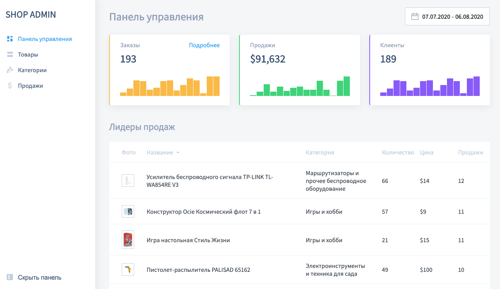

# Admin Dashboard

**Important!**

For correct build via Webpack you must have: 

* nodejs >=16.13.1
* npm >= 7.10.0

Проект - это фронтенд часть типичной "Панели управления" для магазина товаров, 
реализованная на чистом JavaScript.

### Preview

### Tech stack

*  Javascript
*  HTML
*  CSS

### To start project in development mode:

* `npm install` - установит необходимые зависимости
* `npm run develop` - запустит "WebpackDevServer"

**Note:** Версии требуемые проектом указаны в `package.json` в поле `engines` 

### To build project:

`npm run build` - "соберет" проект в "production" режиме.

### To deploy project to GitHub Pages

* `npm run build` - "соберет" проект в "production" режиме.
* `npm run deploy` - "зальет" содержимое директории `buid` на GitHub Pages, после чего
 проект будет доступен по адресу `https://<ваш nickname на github>.github.io/admin_shop_dashboard`

###### P.S. данный проект выполнен как финальное задание курса JS для программистов
